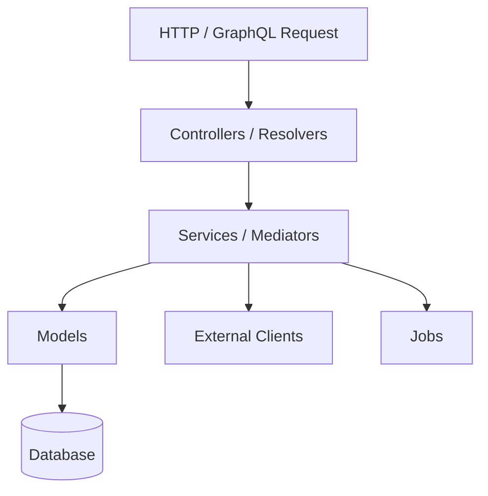
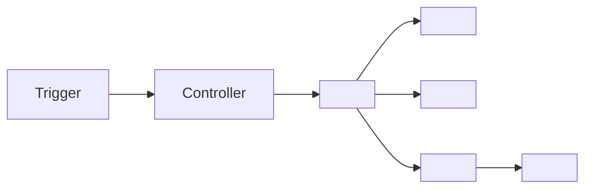

# Output Templates

One template per document type. Replace all `<placeholders>` with discovered content. Remove sections not applicable to the codebase.

---

## INDEX.md

```markdown
# <Repo Name> — System Documentation Index

> Generated: <YYYY-MM-DD> · Branch: `<branch>` · Commit: `<SHA>`
> Stack: <language> / <framework> / <database>

## What This System Does

<3–5 sentences describing the application's purpose, its primary actors, and the high-level flow of value through the system. Written for a developer new to the codebase.>

## High-Level Architecture

```mermaid
flowchart LR
  <Actor> --> <EntryPoint>
  <EntryPoint> --> <CoreLayer>
  <CoreLayer> --> <DB>[(Database)]
  <CoreLayer> --> <Jobs>[Background Jobs]
  <Jobs> --> <External>[External APIs]
```

## Architecture Documents

| Document | Description |
|----------|-------------|
| [System Overview](architecture/overview.md) | Layers, entry points, tech stack, bounded contexts |
| [Data Models](architecture/data-models.md) | Entity relationships, key fields, domain aggregates |
| [Background Processing](architecture/background-processing.md) | Job classes, queues, scheduling, retry patterns |
| [External Integrations](architecture/external-integrations.md) | Third-party services, clients, auth patterns |
| [<Concept>](architecture/<concept>.md) | <one-line description> |

## Feature Documents

| Feature | Description |
|---------|-------------|
| [<Feature Name>](features/<feature-name>.md) | <one-line description of what this feature does> |

## How to Use These Docs

- **Building a feature** → read the relevant [features/](features/) doc first, then follow links to architecture docs it depends on
- **Tracing a data flow** → find the feature doc and look at its "Data Flow" section
- **Understanding relationships** → start at [architecture/overview.md](architecture/overview.md)
- **Onboarding** → read this index, then the architecture overview, then the features most relevant to your work
```

---

## architecture/overview.md

```markdown
# Architecture Overview

> Part of: [System Documentation Index](../INDEX.md)

## Purpose

<1–2 sentences on this application's role in the broader system.>

## Tech Stack

| Layer | Technology | Notes |
|-------|-----------|-------|
| Language | <Ruby 3.x> | |
| Framework | <Rails 8> | |
| Database | <PostgreSQL> | |
| Background Jobs | <Sidekiq> | |
| API Style | <GraphQL> | |
| Auth | <Devise / JWT> | |
| Tests | <RSpec> | |

## Entry Points

| Type | Path | Description |
|------|------|-------------|
| HTTP routes | `config/routes.rb` | <summary> |
| GraphQL | `engines/graphqlfox/app/graphql/` | <summary> |
| Background jobs | `app/jobs/` | <summary> |
| WebSocket | `<path>` | <summary> |

## Architectural Layers



| Layer | Directories | Responsibility |
|-------|------------|----------------|
| Entry | `app/controllers/`, `engines/**/graphql/` | Parse input, authorise, delegate |
| Service | `app/services/`, `engines/**/services/` | Orchestrate business logic |
| Model | `app/models/` | Persistence, domain rules, associations |
| Infrastructure | `app/jobs/`, `app/mailers/` | Async work, notifications |

## Engines / Bounded Contexts

| Engine | Path | Owns |
|--------|------|------|
| <name> | `engines/<name>/` | <what domain it owns> |

## Related Documents

- [Data Models](data-models.md)
- [Background Processing](background-processing.md)
- [External Integrations](external-integrations.md)
- Features that depend on this architecture: <link>, <link>
```

---

## architecture/data-models.md

```markdown
# Data Models

> Part of: [System Documentation Index](../INDEX.md) · [Architecture Overview](overview.md)

## Entity Relationship Diagram

```mermaid
erDiagram
  <EntityA> ||--o{ <EntityB> : "<relationship>"
  <EntityB> }o--|| <EntityC> : "<relationship>"
```

## Domain Aggregates

| Aggregate | Core Model | Supporting Models | Purpose |
|-----------|-----------|-------------------|---------|
| <name> | `<Model>` | `<ModelA>`, `<ModelB>` | <what domain concept it represents> |

## Model Reference

### `<ModelName>`

> `app/models/<model>.rb` · Used by: [<FeatureName>](../features/<feature>.md)

**Key fields:**

| Field | Type | Purpose |
|-------|------|---------|
| `<field>` | `<type>` | <purpose> |

**Associations:**
- `belongs_to :<name>` → [`<Model>`](#modelname-1)
- `has_many :<name>` → [`<Model>`](#modelname-2)

**Notable behaviour:** <soft delete, STI, polymorphism, important scopes, validations>

---
```

---

## architecture/background-processing.md

```markdown
# Background Processing

> Part of: [System Documentation Index](../INDEX.md) · [Architecture Overview](overview.md)

## Job Inventory

| Job Class | File | Queue | Trigger | Retry | Idempotent? |
|-----------|------|-------|---------|-------|-------------|
| `<JobName>` | `app/jobs/<job>.rb` | `<queue>` | <what enqueues it> | <count> | Yes / No |

## Job Details

### `<JobName>`

> `app/jobs/<job>.rb` · Related feature: [<Feature>](../features/<feature>.md)

**Purpose:** <what it does>
**Enqueued by:** `<ClassName#method>` when <condition>
**Side effects:** <what it writes, sends, or triggers>
**Fan-out pattern:** <if applicable — does it spawn child jobs?>
**Error handling:** <rescue strategy, dead-letter behaviour>
```

---

## architecture/external-integrations.md

```markdown
# External Integrations

> Part of: [System Documentation Index](../INDEX.md) · [Architecture Overview](overview.md)

## Integration Inventory

| Service | Purpose | Client | Auth |
|---------|---------|--------|------|
| <Stripe> | <Payments> | `app/services/stripe/` | API key (ENV) |

## Integration Details

### <Service Name>

> Client: `<path>` · Used by: [<Feature>](../features/<feature>.md)

**Purpose:** <what the integration does>
**Credentials:** `ENV['<KEY_NAME>']`
**Key operations:** <list of methods / endpoints called>
**Error handling:** <how failures surface — exception, Result::Failure, etc.>
**Notes:** <rate limits, webhooks inbound, sandbox vs. live env>
```

---

## features/<feature-name>.md

```markdown
# Feature: <Feature Name>

> Part of: [System Documentation Index](../INDEX.md)
> Architecture dependencies: [<Arch Doc>](../architecture/<doc>.md), ...

## What It Does

<2–4 sentences describing the feature from a user/business perspective.>

## Entry Points

| Type | Location | Description |
|------|----------|-------------|
| <GraphQL mutation> | `<resolver file>:L<n>` | <summary> |
| <HTTP route> | `<controller>:L<n>` | <summary> |

## Component Map



| Component | File | Role |
|-----------|------|------|
| `<ControllerName>` | `<path>:L<n>` | <role> |
| `<ServiceName>` | `<path>:L<n>` | <role> |
| `<ModelName>` | `<path>:L<n>` | <role> |

## Data Flow: <Primary Flow Name>

**Pattern:** Synchronous / Background job / Event-driven / Webhook

1. **Trigger:** <HTTP POST /path | job enqueue | event | webhook>
2. **`<ClassName#method>`** (`<file>:L<n>`): <what it does>
3. **`<ClassName#method>`** (`<file>:L<n>`): <what it does>
4. **Side effects:** <emails sent, jobs enqueued, events emitted, external calls>
5. **Response:** <what the caller receives>

**Error paths:**
- `<condition>` → `<how handled — rescue, Failure(), 422 response, etc.>`

## Related Documents

- Architecture: [<Arch Doc>](../architecture/<doc>.md)
- Adjacent features: [<Feature>](../features/<feature>.md)
```

---

## Linking Rules

When writing documents, apply these rules consistently:

1. Every document begins with a `> Part of:` breadcrumb linking back to `INDEX.md` and to any parent architecture doc.
2. Every model reference in a feature doc links to the model's anchor in `architecture/data-models.md`.
3. Every job reference in a feature doc links to the job's anchor in `architecture/background-processing.md`.
4. Every external service reference in a feature doc links to the service's anchor in `architecture/external-integrations.md`.
5. Architecture docs back-link to every feature that uses them under a "Used by features" list.
6. All links use relative paths from the document's location (e.g., `../INDEX.md`, `../features/billing.md`).
